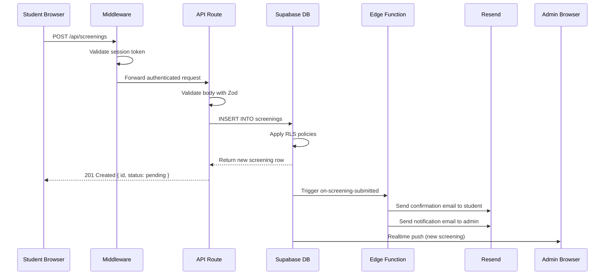
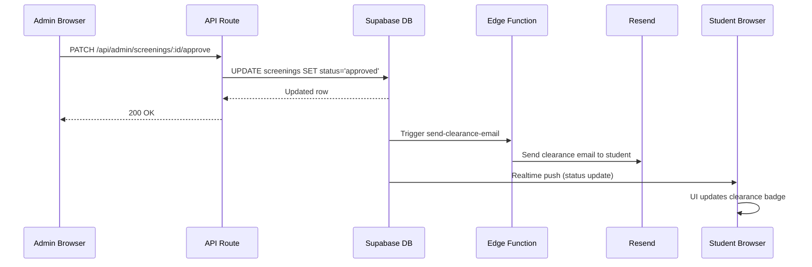
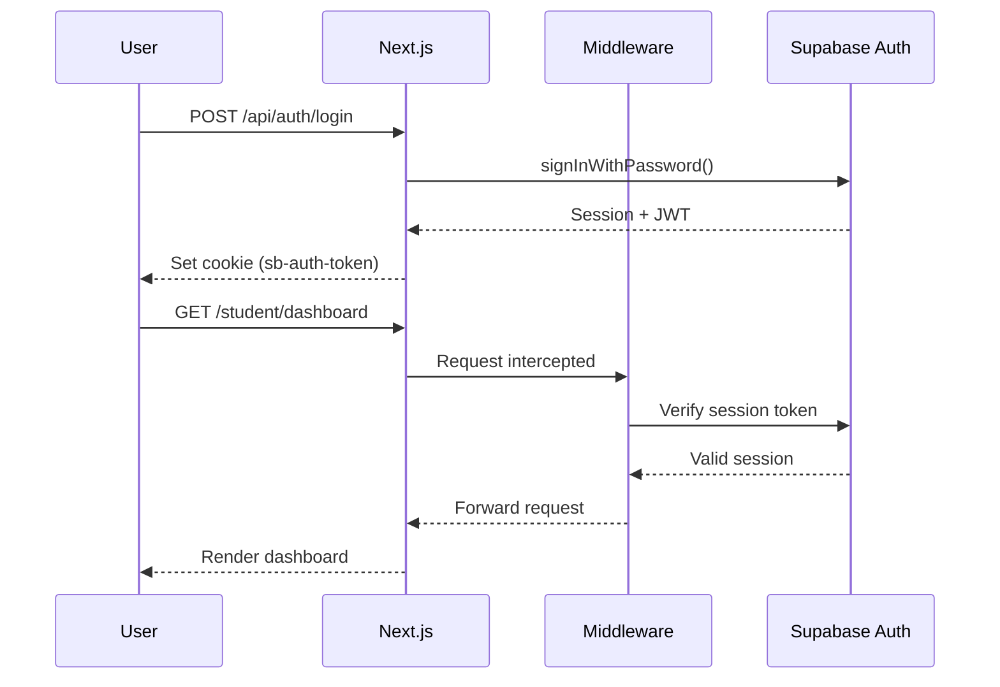

Data in LASUMedScreen flows through well-defined layers. Understanding this flow helps you extend the platform, debug issues, and reason about security boundaries. Each diagram below traces a specific user journey end-to-end — from the browser action that initiates the flow to the final state change that the user sees reflected in the UI.

## Screening Submission Flow

When a student submits a medical screening form, the request travels through middleware, an API route, the Supabase database, and an Edge Function before both the student and the admin receive confirmation.



Notice that the student receives a `201 Created` response as soon as the database write succeeds — the email delivery and the admin notification are fully asynchronous and do not block the API response. This keeps form submissions fast even when the email provider is under load.

## Clearance Approval Flow

When a medical officer approves a student's screening, the status update propagates to the student's browser in real time without requiring a page refresh.



The `send-clearance-email` Edge Function is triggered by a Postgres database trigger on the `screenings` table. It checks the new `status` value and composes a clearance certificate email with the student's details fetched from the database. Meanwhile, the student's browser — which maintains an active Supabase Realtime subscription on their own screening row — receives the status change and updates the clearance badge instantly.

## Authentication Flow

Every protected page and API route depends on a valid Supabase session. The sequence below shows how a user logs in and how that session is verified on every subsequent request.



The session JWT is stored in an HTTP-only cookie set by the Next.js API route — it is never written to `localStorage` or exposed to JavaScript running in the browser. On every subsequent request, the root middleware reads this cookie, calls Supabase Auth to verify the token, and either forwards the request or redirects the user to `/login`.

## Client vs. Server Data Fetching

LASUMedScreen uses three distinct data-fetching patterns depending on where in the rendering pipeline the data is needed.

**Server Components** use the server Supabase client (`lib/supabase/server.ts`) and fetch data at render time. Because the fetch happens on the server before the HTML is streamed to the browser, there is no waterfall effect and no loading spinner for the initial page data. This is the preferred pattern for all dashboard pages where data must be present before the user sees the page.

**Client Components** use the browser Supabase client (`lib/supabase/client.ts`) exclusively for real-time subscriptions and interactive user actions — such as subscribing to screening status changes or triggering optimistic UI updates after a form submission. Client Components should never perform initial data loads that could instead be handled by a Server Component.

**API Routes** use the service role client for admin operations that intentionally bypass Row Level Security — for example, bulk status updates or cross-student queries run by medical staff. The service role key is only ever referenced in server-side API routes and Edge Functions; it must never be imported into any component file.

```tsx app/(dashboard)/student/dashboard/page.tsx
// Server Component — data fetched server-side
import { createClient } from '@/lib/supabase/server'

export default async function StudentDashboard() {
  const supabase = createClient()
  const { data: { user } } = await supabase.auth.getUser()
  const { data: screening } = await supabase
    .from('screenings')
    .select('*')
    .eq('student_id', user.id)
    .single()

  return <ScreeningStatus screening={screening} />
}
```

In this pattern, `createClient()` reads the session cookie on the server, so the query runs with the student's own permissions and Supabase RLS automatically scopes the result to their record. No token handling or loading state is required in the component itself.

<CardGroup cols={2}>
  <Card title="API Endpoints" icon="code" href="/docs/backend/api-endpoints">
    Browse every REST endpoint with request and response schemas.
  </Card>
  <Card title="Database Schema" icon="database" href="/docs/backend/database-schema">
    Explore the Postgres table definitions, relationships, and RLS policies.
  </Card>
</CardGroup>
