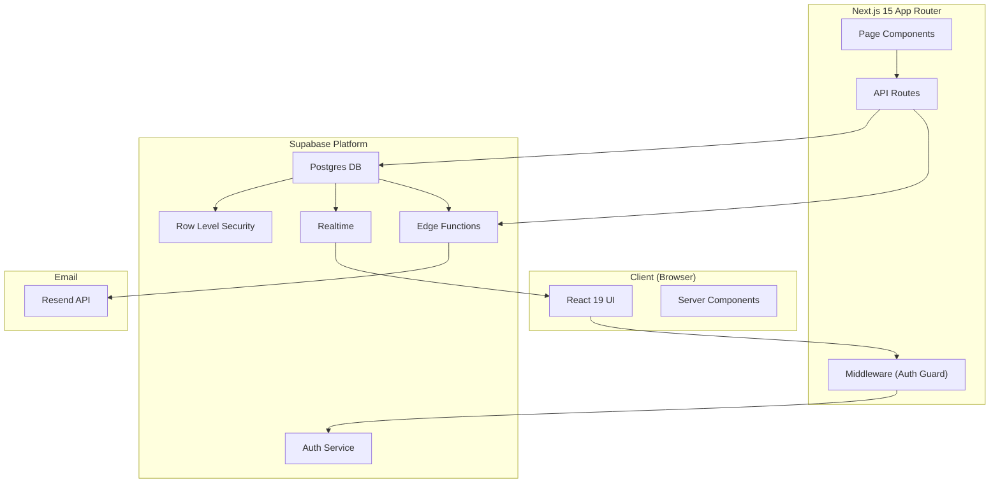

LASUMedScreen follows a modern full-stack architecture with a clear separation between the presentation layer (Next.js 15 App Router), the data layer (Supabase Postgres), and asynchronous processing (Supabase Edge Functions + Resend). Each layer has a single, well-defined responsibility — making the system easier to extend, test, and reason about as your institution's screening workflows grow.

## Architecture Diagram

The diagram below shows how every major system component connects, from the student's browser all the way to the email delivery service.

## Layer Responsibilities

Each layer owns a specific slice of the system. The table below maps every technology to its role so you always know where a given concern lives.

| Layer | Technology | Responsibility |
|---|---|---|
| Presentation | React 19 + Tailwind CSS | UI components, forms, dashboards |
| Routing | Next.js 15 App Router | Page routing, middleware, layouts |
| API Layer | Next.js API Routes | REST endpoints for client/server communication |
| Auth | Supabase Auth | Session management, user roles |
| Database | Supabase Postgres | Persistent storage with RLS |
| Real-Time | Supabase Realtime | Live status updates |
| Async Processing | Supabase Edge Functions | Post-submission workflows |
| Email | Resend | Transactional email delivery |

## Request Lifecycle

When a student submits a medical screening form, the following sequence of events occurs across every layer of the system:

1. **Student submits the form** — React calls a server action or API route with the form payload.
2. **Middleware validates the session token** — The Next.js middleware intercepts the request and confirms the user has an active Supabase session before the request reaches the API route.
3. **API route validates and sanitizes input with Zod** — The incoming request body is parsed against a strict Zod schema. Invalid or missing fields are rejected with a structured error response before any database interaction occurs.
4. **Data is written to Supabase Postgres** — The validated payload is inserted into the `screenings` table with the authenticated user's ID attached.
5. **A database trigger fires an Edge Function** — Postgres triggers a `on-screening-submitted` Edge Function asynchronously, decoupling the write operation from downstream notifications.
6. **Edge Function sends a confirmation email via Resend** — The function composes a transactional email and delivers it to the student's registered address through the Resend API.
7. **Medical staff sees the new submission via Supabase Realtime** — The admin dashboard receives a Realtime push event and updates the screening queue without a page refresh.

## Security Boundaries

LASUMedScreen enforces security at three distinct layers, so a bypass at one layer does not compromise the others.

1. **Next.js Middleware** — Runs before every request reaches a page or API route. It reads the Supabase session cookie, verifies the JWT, and redirects unauthenticated users to the login page. This is your outermost defense.
2. **API Route validation** — Every API route applies a Zod schema to the incoming request body. This prevents malformed data from reaching the database and provides a clear contract for every endpoint's expected shape.
3. **Supabase RLS** — Row Level Security policies are enforced at the database level, regardless of how a query arrives. Students can only read and update their own screening records; admin operations require the service role key, which is never exposed to the client.

<CardGroup cols={2}>
  <Card title="Folder Structure" icon="folder-tree" href="/docs/architecture/folder-structure">
    Explore every directory and file in the LASUMedScreen project.
  </Card>
  <Card title="Data Flow" icon="arrow-right-arrow-left" href="/docs/architecture/data-flow">
    Trace how data moves from React forms through Supabase and back.
  </Card>
</CardGroup>
