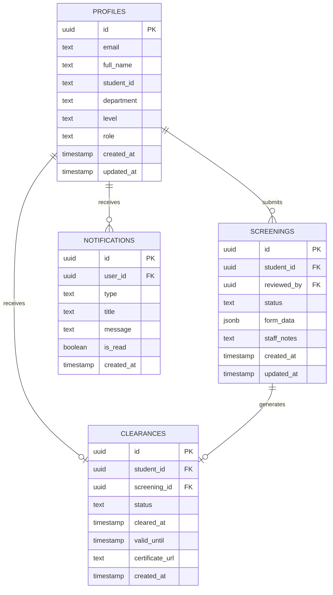

LASUMedScreen uses Supabase Postgres as its primary data store. The schema is designed around three core entities — users, screenings, and clearances — with a supporting notifications table for in-app and email activity logs. Row Level Security is enforced at the database level on every table, ensuring that data isolation is guaranteed even if application-layer checks are bypassed.

## Entity Relationship Diagram

The diagram below shows every table, its columns, and the relationships between them.



## Table Reference

### `profiles`

Extends Supabase Auth users with application-specific metadata. A row is inserted automatically via a Postgres trigger whenever a new user is created in `auth.users`.

| Column       | Type        | Constraints                          | Description                                    |
| ------------ | ----------- | ------------------------------------ | ---------------------------------------------- |
| `id`         | uuid        | PK, references `auth.users`          | Matches the Supabase Auth user ID exactly      |
| `email`      | text        | NOT NULL, UNIQUE                     | User's email address                           |
| `full_name`  | text        | NOT NULL                             | Display name used across the UI                |
| `student_id` | text        | UNIQUE, nullable                     | Formatted student ID (e.g., `CSC/2021/001`)    |
| `department` | text        | nullable                             | Student's academic department                  |
| `level`      | text        | nullable                             | Academic level (100–500)                       |
| `role`       | text        | NOT NULL, default `'student'`        | Either `'student'` or `'admin'`                |
| `created_at` | timestamptz | NOT NULL, default `now()`            | Timestamp when the profile was created         |
| `updated_at` | timestamptz | NOT NULL, default `now()`            | Timestamp of the most recent profile update    |

---

### `screenings`

Stores every medical screening form submission. The `form_data` JSONB column holds the full structured payload from the screening form, making the schema flexible as form fields evolve.

| Column        | Type        | Constraints                                          | Description                                      |
| ------------- | ----------- | ---------------------------------------------------- | ------------------------------------------------ |
| `id`          | uuid        | PK, default `gen_random_uuid()`                      | Unique identifier for the screening record       |
| `student_id`  | uuid        | NOT NULL, FK → `profiles.id`                         | The student who submitted this screening         |
| `reviewed_by` | uuid        | nullable, FK → `profiles.id`                         | Admin who reviewed and actioned this screening   |
| `status`      | text        | NOT NULL, CHECK IN `('pending','approved','rejected')` | Current review status                            |
| `form_data`   | jsonb       | NOT NULL                                             | Full structured form submission payload          |
| `staff_notes` | text        | nullable                                             | Admin notes written during review                |
| `created_at`  | timestamptz | NOT NULL, default `now()`                            | When the screening was submitted                 |
| `updated_at`  | timestamptz | NOT NULL, default `now()`                            | When the screening was last updated              |

---

### `clearances`

Records the clearance outcome for a student after their screening is approved. One clearance record exists per student at most; re-screening replaces the existing record.

| Column            | Type        | Constraints                                    | Description                                          |
| ----------------- | ----------- | ---------------------------------------------- | ---------------------------------------------------- |
| `id`              | uuid        | PK, default `gen_random_uuid()`                | Unique identifier for the clearance record           |
| `student_id`      | uuid        | NOT NULL, FK → `profiles.id`                   | The student receiving clearance                      |
| `screening_id`    | uuid        | NOT NULL, FK → `screenings.id`                 | The screening that generated this clearance          |
| `status`          | text        | NOT NULL, CHECK IN `('cleared','not_cleared')` | Whether the student is currently cleared             |
| `cleared_at`      | timestamptz | nullable                                       | Timestamp when clearance was granted                 |
| `valid_until`     | timestamptz | nullable                                       | Clearance expiry date (one year from `cleared_at`)   |
| `certificate_url` | text        | nullable                                       | Public URL to the generated certificate PDF          |
| `created_at`      | timestamptz | NOT NULL, default `now()`                      | When the clearance record was created                |

---

### `notifications`

An in-app and email notification log. Every significant event in the platform — submission, approval, rejection, clearance — writes a row here. The admin dashboard queries this table for failed email alerts.

| Column       | Type        | Description                                                              |
| ------------ | ----------- | ------------------------------------------------------------------------ |
| `id`         | uuid        | Primary key                                                              |
| `user_id`    | uuid        | Target user (FK → `profiles.id`)                                         |
| `type`       | text        | Event type: `screening_submitted`, `approved`, `rejected`, `cleared`, `email_failed` |
| `title`      | text        | Short notification title shown in the UI                                 |
| `message`    | text        | Full notification body text                                              |
| `is_read`    | boolean     | Whether the user has marked this notification as read                    |
| `created_at` | timestamptz | When the notification was created                                        |

---

## Row Level Security

RLS policies guarantee that each user can only access data they are permitted to see, regardless of how queries reach the database. The policies below cover the most critical access patterns on the `screenings` table.

```sql
-- Students can only read their own screenings
CREATE POLICY "students_read_own_screenings"
ON screenings FOR SELECT
USING (auth.uid() = student_id);

-- Students can only insert their own screenings
CREATE POLICY "students_insert_own_screenings"
ON screenings FOR INSERT
WITH CHECK (auth.uid() = student_id);

-- Admins can read all screenings
CREATE POLICY "admins_read_all_screenings"
ON screenings FOR SELECT
USING (
  EXISTS (
    SELECT 1 FROM profiles
    WHERE id = auth.uid() AND role = 'admin'
  )
);
```

<Warning>
  RLS is enabled on all tables by default. Never disable it for production
  data. Use the service role key only in server-side Edge Functions when RLS
  needs to be bypassed for administrative operations — and always validate the
  request source before doing so.
</Warning>
