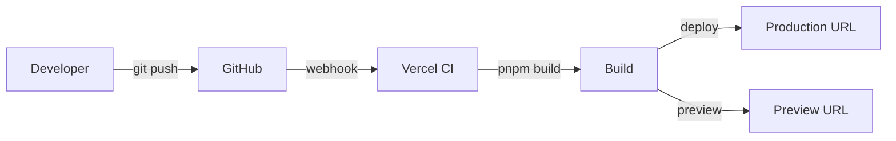

Deploying LASUMedScreen to production involves building the Next.js application, setting your environment variables on the host, and ensuring your Supabase project is configured for production traffic. This page walks you through the full deployment lifecycle — from a local production build to a fully automated CI/CD pipeline.

## Production Build

Run the following command to produce an optimised production build:

```bash
pnpm build
```

This runs `next build`, which performs the following steps:

1. **Type-checks** the entire codebase — the build fails if any TypeScript errors are present.
2. **Compiles and bundles** all pages, API routes, and server components.
3. **Generates static pages** where possible using static site generation (SSG) and incremental static regeneration (ISR).
4. **Outputs the `.next` directory**, which contains everything needed to run the application.

After the build completes, review the route size table printed to your terminal. Aim for less than **200 KB** per route (first load JS). Routes that exceed this should be audited for unnecessary client-side imports.

## Vercel Deployment (Recommended)

Vercel is the recommended deployment target for LASUMedScreen. It has native Next.js support, automatic preview deployments on pull requests, and seamless environment variable management.

Follow these steps to deploy:

1. Push your repository to GitHub.
2. Go to [vercel.com](https://vercel.com), sign in, and click **Add New → Project**.
3. Import your GitHub repository.
4. Set the **Framework Preset** to **Next.js** (Vercel usually detects this automatically).
5. Open the **Environment Variables** section and add all variables from your `.env.local`.
6. Click **Deploy**.

Every subsequent push to `main` triggers a new production deployment. Every pull request gets its own preview URL.



## Self-Hosted with Docker

If you need to host LASUMedScreen on your own infrastructure, use the multi-stage Dockerfile below. It produces a minimal production image using Next.js's [standalone output](https://nextjs.org/docs/app/api-reference/next-config-js/output).

```dockerfile Dockerfile
FROM node:20-alpine AS deps
WORKDIR /app
COPY package.json pnpm-lock.yaml ./
RUN npm install -g pnpm && pnpm install --frozen-lockfile

FROM node:20-alpine AS builder
WORKDIR /app
COPY --from=deps /app/node_modules ./node_modules
COPY . .
RUN pnpm build

FROM node:20-alpine AS runner
WORKDIR /app
ENV NODE_ENV=production
COPY --from=builder /app/.next/standalone ./
COPY --from=builder /app/.next/static ./.next/static
COPY --from=builder /app/public ./public
EXPOSE 3000
CMD ["node", "server.js"]
```

Use `docker-compose` to wire the application container to your environment variables:

```yaml docker-compose.yml
version: '3.8'
services:
  app:
    build: .
    ports:
      - '3000:3000'
    environment:
      - NEXT_PUBLIC_SUPABASE_URL=${NEXT_PUBLIC_SUPABASE_URL}
      - NEXT_PUBLIC_SUPABASE_ANON_KEY=${NEXT_PUBLIC_SUPABASE_ANON_KEY}
      - SUPABASE_SERVICE_ROLE_KEY=${SUPABASE_SERVICE_ROLE_KEY}
      - RESEND_API_KEY=${RESEND_API_KEY}
      - RESEND_FROM_EMAIL=${RESEND_FROM_EMAIL}
      - NEXT_PUBLIC_APP_URL=${NEXT_PUBLIC_APP_URL}
```

Run `docker compose up --build` to build and start the container. The application will be available on port `3000`.

## CI/CD with GitHub Actions

The workflow below automates linting, type-checking, and Vercel production deployment on every push to `main`. Pull requests trigger the lint and type-check jobs but do not deploy to production.

```yaml .github/workflows/deploy.yml
name: Deploy to Vercel
on:
  push:
    branches: [main]
  pull_request:
    branches: [main]

jobs:
  lint-and-type-check:
    runs-on: ubuntu-latest
    steps:
      - uses: actions/checkout@v4
      - uses: pnpm/action-setup@v2
        with: { version: 8 }
      - uses: actions/setup-node@v4
        with: { node-version: '20', cache: 'pnpm' }
      - run: pnpm install --frozen-lockfile
      - run: pnpm lint
      - run: pnpm type-check

  deploy:
    needs: lint-and-type-check
    runs-on: ubuntu-latest
    if: github.ref == 'refs/heads/main'
    steps:
      - uses: actions/checkout@v4
      - uses: amondnet/vercel-action@v25
        with:
          vercel-token: ${{ secrets.VERCEL_TOKEN }}
          vercel-org-id: ${{ secrets.VERCEL_ORG_ID }}
          vercel-project-id: ${{ secrets.VERCEL_PROJECT_ID }}
          vercel-args: '--prod'
```

Add `VERCEL_TOKEN`, `VERCEL_ORG_ID`, and `VERCEL_PROJECT_ID` as secrets in your GitHub repository settings. You can find these values in your Vercel project's **Settings → General** and **Account Settings** pages.

## Production Checklist

Before going live, verify every item on the checklist below.

<Note>
  Run through this checklist for every new production deployment, not just the first one.

  - [ ] All environment variables set in Vercel or your hosting environment
  - [ ] Production Supabase project created with RLS enabled on all tables
  - [ ] Supabase Auth Site URL and redirect URLs configured for the production domain
  - [ ] Supabase Edge Functions deployed and all required secrets set
  - [ ] Resend domain verified and `RESEND_FROM_EMAIL` updated to the production address
  - [ ] Production build completes without TypeScript errors or warnings
  - [ ] Database migrations applied to the production Supabase project
  - [ ] Admin account created and tested end-to-end
</Note>
