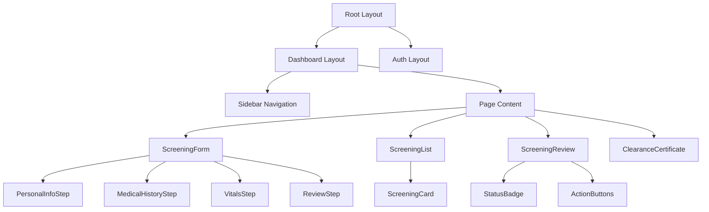

LASUMedScreen organises its React components into four layers — base UI primitives, screening form steps, admin-specific panels, and shared layout elements. This separation keeps components focused, testable, and easy to locate when you need to extend the platform. All components are written in TypeScript and styled with Tailwind CSS utility classes. Client components are explicitly marked with the `'use client'` directive; everything else is a Server Component by default.

## Component Hierarchy

The diagram below shows how the major component groups nest within the application shell.



The `Root Layout` mounts providers and delegates rendering to either the `Auth Layout` or the `Dashboard Layout` depending on which route group the current page belongs to. The `Dashboard Layout` owns the persistent `Sidebar Navigation` and slots in page-level content beneath it.

## Base UI Components (`components/ui/`)

Base UI components are the smallest building blocks in the design system. They are deliberately unstyled beyond the design token layer so that they can be composed into any higher-level component without leaking opinionated spacing or colour. Each component accepts a standard set of HTML props plus a small number of variant props.

| Component | Description |
|---|---|
| `Button` | Primary, secondary, and destructive size-aware variants with loading state |
| `Input` | Text input with integrated error message display and accessible label wiring |
| `Select` | Dropdown with full keyboard navigation, search, and multi-select support |
| `Badge` | Inline status pill for pending, approved, and rejected states |
| `Card` | Padded content container with optional header, footer, and border radius |
| `Modal` | Accessible dialog built on Radix UI with focus trap and scroll lock |
| `Toast` | Timed success and error notification rendered in a fixed viewport portal |
| `Spinner` | Animated loading indicator available in `sm`, `md`, and `lg` sizes |

All base components are exported from a single barrel file at `components/ui/index.ts`, so you can import multiple primitives in one statement:

```tsx components/ui/index.ts
export { Button } from './Button'
export { Input } from './Input'
export { Select } from './Select'
export { Badge } from './Badge'
export { Card } from './Card'
export { Modal } from './Modal'
export { Toast } from './Toast'
export { Spinner } from './Spinner'
```

## Screening Form Components (`components/forms/`)

The student screening submission is a multi-step form split across four discrete step components. All steps are orchestrated by the top-level `ScreeningForm` component, which owns the shared form state and controls step progression.

- **`ScreeningForm`** — Initialises a single `useForm` instance from React Hook Form and passes it down to each step via React context. It manages the current step index, validates only the fields belonging to the active step before advancing, and submits the completed payload to the Supabase edge function on the final step.

- **`PersonalInfoStep`** — Collects full name, student ID, department, and academic level. The student ID field validates against the `AAA/YYYY/NNN` pattern defined in the Zod schema.

- **`MedicalHistoryStep`** — Captures chronic conditions (with a conditional detail textarea that appears when the toggle is enabled), known allergies, current medications, and surgical history.

- **`VitalsStep`** — Records height (cm), weight (kg), blood pressure (systolic/diastolic), and blood group from a constrained enum select.

- **`ReviewStep`** — Displays a read-only summary of all collected data before the student confirms submission. Each section has an edit shortcut that jumps back to the relevant step.

The full validation schema shared across all steps is defined centrally:

```ts lib/validations/screening.ts
import { z } from 'zod'

export const screeningSchema = z.object({
  // Personal Info
  fullName: z.string().min(2, 'Full name is required'),
  studentId: z.string().regex(/^[A-Z]{3}\/\d{4}\/\d{3}$/, 'Invalid student ID format'),
  department: z.string().min(1, 'Department is required'),
  level: z.enum(['100', '200', '300', '400', '500']),
  // Medical History
  hasChronicCondition: z.boolean(),
  chronicConditionDetails: z.string().optional(),
  allergies: z.string().optional(),
  // Vitals
  height: z.number().min(50).max(300),
  weight: z.number().min(10).max(500),
  bloodGroup: z.enum(['A+', 'A-', 'B+', 'B-', 'AB+', 'AB-', 'O+', 'O-']),
})

export type ScreeningFormData = z.infer<typeof screeningSchema>
```

The `ScreeningFormData` type is inferred directly from the schema, so your form state, API payload, and database insert all share a single source of truth. Zod parses the data at the point of submission, ensuring no invalid record reaches the database.

## Admin Components (`components/admin/`)

Admin components handle the clinical review workflow — listing incoming screenings, inspecting individual submissions, and recording decisions. They are all client components because they manage interactive state such as selected rows, confirmation dialogs, and optimistic status updates.

| Component | Description |
|---|---|
| `ScreeningTable` | Sortable and filterable table of all submissions with pagination and bulk-select |
| `ScreeningReview` | Full detail view of a single screening with the approve / reject action panel |
| `StatusBadge` | Color-coded status pill that maps database status strings to visual variants |
| `ActionButtons` | Grouped approve, reject, and request-more-info buttons with confirmation guards |
| `StudentProfile` | Compact student summary card showing photo, ID, department, and contact info |

The `ScreeningTable` uses server-side pagination — each page change triggers a new Supabase query rather than fetching all rows up front. Filters (status, department, date range) are reflected in the URL as search params, making filtered views bookmarkable and shareable between admin users.

## Shared Components (`components/shared/`)

Shared components are layout-level elements used across both the student and admin sides of the dashboard. They are aware of the current route and session but contain no domain-specific business logic.

- **`Navbar`** — The top bar rendered inside the dashboard layout. It displays the current page title on the left and the user avatar menu on the right. The avatar menu contains links to the user's profile, settings, and a sign-out action.

- **`Sidebar`** — The collapsible left navigation rail. It renders a role-filtered list of navigation links (see [Pages & Routing](/docs/frontend/pages-and-routing)) and highlights the active route. On mobile it renders as a slide-in drawer triggered by a hamburger button in the `Navbar`.

- **`Breadcrumbs`** — Automatically generated from the current pathname. Each segment is converted to a human-readable label using a static label map, and all but the last segment are rendered as links. The breadcrumb trail is rendered directly below the `Navbar`.

- **`PageHeader`** — A standardised page title block that accepts a `title`, optional `description`, and an optional `action` slot for page-level CTA buttons. Using `PageHeader` consistently gives every page the same visual rhythm.

- **`EmptyState`** — A centred illustration and message shown when a data list has no results. It accepts a `title`, `description`, and optional `action` button so each empty state can guide the user toward the next step (for example, prompting a student to start their first screening).
