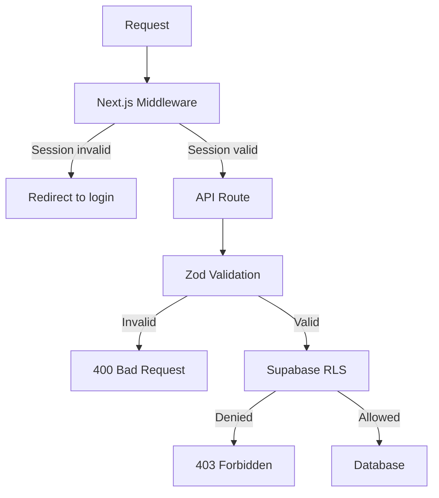

Security is a core requirement for LASUMedScreen given that it handles sensitive student health data. This page documents every security control in the application — from database-level RLS to input validation and XSS prevention. You should read this page in full before deploying LASUMedScreen to a production environment.

## Security Layers Overview

Every request passes through multiple independent security controls. A failure in one layer is caught by the next, ensuring no single point of bypass.



## Authentication Security

LASUMedScreen uses Supabase Auth to manage all user identities. The following controls harden the authentication layer against common attacks.

- Sessions are validated on every request by Next.js middleware — unauthenticated requests are immediately redirected to the login page before reaching any route handler
- JWT access tokens expire after **1 hour**; refresh tokens expire after **7 days**, limiting the blast radius of a stolen token
- Password minimum length is enforced by Supabase Auth configuration in the project dashboard
- Email verification is required before a student can log in for the first time
- Admin accounts cannot be self-registered — they are created manually by a super-admin or via a protected invite flow

## Row Level Security

Row Level Security (RLS) is the primary database-level defense in LASUMedScreen. Even if application code contains a bug that skips authorization checks, RLS ensures the database itself refuses unauthorized reads and writes.

- RLS is **enabled on all tables** in the Supabase project
- Students can only read and write their own rows — cross-student data access is impossible at the query level
- Admins have broader access but are still restricted by role-checked policies that verify the `user_role` claim in the JWT
- The **service role key** is used only in Edge Functions running in a trusted server environment — it is never included in client-side code or exposed to the browser

The following policy is an example of how student data isolation is enforced at the database level:

```sql policies/screenings_rls.sql
-- Prevent students from reading other students' form data
CREATE POLICY "students_own_data_only"
ON screenings FOR ALL
USING (auth.uid() = student_id)
WITH CHECK (auth.uid() = student_id);
```

## Input Validation

Every API route in LASUMedScreen validates its inputs with a Zod schema before touching the database. This prevents malformed data from being persisted and protects against type confusion attacks.

```ts lib/validations/screening.ts
// Every API route validates input before touching the database
export const screeningSchema = z.object({
  studentId: z.string().regex(/^[A-Z]{3}\/\d{4}\/\d{3}$/),
  height: z.number().min(50).max(300),
  weight: z.number().min(10).max(500),
  bloodGroup: z.enum(['A+', 'A-', 'B+', 'B-', 'AB+', 'AB-', 'O+', 'O-']),
})
```

Validation errors return a `400 Bad Request` response with a structured error body. The route handler never proceeds to a database operation if `safeParse` returns `success: false`.

## XSS Prevention

Cross-site scripting (XSS) attacks inject malicious scripts into pages viewed by other users. LASUMedScreen mitigates this at multiple levels.

- React escapes all dynamic content by default — there is **no use of `dangerouslySetInnerHTML`** anywhere in the codebase
- User-submitted text is stored as plain strings in the database and rendered as text nodes by React, never as raw HTML
- Next.js Content Security Policy headers are configured to block inline scripts and restrict resource origins

The following security headers are applied to every response via `next.config.ts`:

```ts next.config.ts
const securityHeaders = [
  { key: 'X-Frame-Options', value: 'DENY' },
  { key: 'X-Content-Type-Options', value: 'nosniff' },
  { key: 'Referrer-Policy', value: 'strict-origin-when-cross-origin' },
  { key: 'Permissions-Policy', value: 'camera=(), microphone=(), geolocation=()' },
]
```

## CSRF Protection

Cross-site request forgery (CSRF) attacks trick authenticated users into unknowingly submitting requests to your application from a malicious site. Next.js API Routes and Server Actions are protected from CSRF by the same-origin `Cookie` header requirement — a cross-origin page cannot read or set your application's cookies. The `SameSite=Lax` cookie attribute provides an additional layer of protection by preventing the browser from sending session cookies on cross-site navigated requests.

## Secret Management

Credentials and API keys must never be committed to version control or exposed to the browser. Follow these rules in every environment.

- Add all secrets to `.env.local` for local development — this file is listed in `.gitignore` by default
- Use **Vercel Environment Variables** (or your host's equivalent) for staging and production secrets
- The Supabase **service role key** must only appear in server-side code — Edge Functions, API routes, and server actions
- Rotate keys immediately if they are ever accidentally committed or logged

## Security Checklist

Use this checklist to verify that all controls are active before going live.

| Control | Implementation | Status |
| --- | --- | --- |
| Authentication | Supabase Auth with JWT | ✅ Implemented |
| Authorization | RLS with role checks | ✅ Implemented |
| Input validation | Zod schemas | ✅ Implemented |
| XSS prevention | React defaults with CSP | ✅ Implemented |
| CSRF protection | SameSite cookies | ✅ Implemented |
| Secret management | Env vars, not in code | ✅ Implemented |
| HTTPS | Vercel/host enforced | ✅ Implemented |
| Sensitive data in URL | Never | ✅ Implemented |