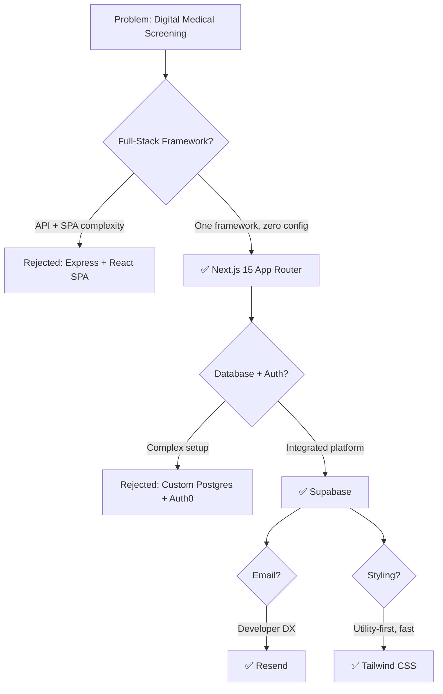

This page documents the development journey of LASUMedScreen — from the initial problem statement and technology selection through implementation stages to production deployment. Understanding this evolution helps you reason about current design decisions and plan future changes.

## Problem Statement

LASU (Lagos State University) operated a fully paper-based medical screening process before LASUMedScreen existed. Every semester before resumption, students were required to queue physically at the health centre to undergo routine health checks and collect a clearance slip — a process that created long lines, misplaced records, delayed clearances, and introduced significant room for human error.

The goal of LASUMedScreen was to replace this with a digital platform that achieves three things:

- **Digitizes the form** — Students complete and submit their medical screening data online, eliminating paper entirely.
- **Enables remote review** — Medical staff and administrators review submissions from the dashboard without requiring the student to be present.
- **Automates notifications** — Students receive real-time and email updates as their screening status changes, removing the need for follow-up visits.

## Technology Selection

Every technology in LASUMedScreen was chosen deliberately to minimize complexity, maximize developer productivity, and reduce operational overhead. The diagram below walks through the key decision points.

## Implementation Stages

LASUMedScreen was built incrementally across eight focused stages. Each stage produced a working, testable increment of the system.

<Steps>
  <Step title="Stage 1: Foundation">
    Project scaffolding, Next.js 15 setup, and Tailwind CSS configuration. A Supabase project was created and the initial database schema was designed — covering the `profiles`, `screenings`, and `notifications` tables. This stage established the folder structure, path aliases, and linting rules that the rest of the codebase follows.
  </Step>

  <Step title="Stage 2: Authentication">
    Supabase Auth was integrated to handle registration, login, and session management. Registration and login flows were built as Server Actions. Middleware was added to protect all routes under `/dashboard` and `/admin`, and role-based redirects were implemented so students land on their dashboard and admins land on the admin panel after sign-in.
  </Step>

  <Step title="Stage 3: Screening Forms">
    The multi-step medical screening form was built using React Hook Form and Zod. Form state is persisted across steps using React context so that navigating between steps does not lose the user's input. Submission triggers a Server Action that validates the payload and writes the screening record to Supabase.
  </Step>

  <Step title="Stage 4: Admin Dashboard">
    The admin screening review interface was built as a React Server Component that fetches all pending screenings on the server. Staff can update the status of a screening (pending → approved / rejected), leave notes, and filter and sort submissions by date, status, or student ID. Status changes are written back to Supabase and trigger a notification record.
  </Step>

  <Step title="Stage 5: Notifications">
    Resend email integration was added via a Supabase Edge Function that listens to the `notifications` table through a database webhook. When a new notification row is inserted, the Edge Function fires an email to the student. An in-app notification bell was also added to the student dashboard that queries unread notification rows in real time.
  </Step>

  <Step title="Stage 6: Real-Time">
    Supabase Realtime subscriptions were added to the student dashboard so that screening status updates appear immediately without a page refresh. The student's screening status card listens to changes on their own `screenings` row and re-renders when the admin updates it.
  </Step>

  <Step title="Stage 7: Polish & Security">
    RLS policies were audited and hardened to ensure no cross-user data leakage. All form inputs were reviewed for sanitization. An accessibility audit was performed and ARIA labels, keyboard navigation, and focus management were improved. Responsive design was fixed across breakpoints and security headers were added to `next.config.ts`.
  </Step>

  <Step title="Stage 8: Deployment">
    The application was deployed to Vercel with a production Supabase project. Edge Functions were deployed using the Supabase CLI. A CI/CD pipeline using GitHub Actions was configured to run type checks and linting on every pull request before merging to `main`.
  </Step>
</Steps>

## Key Architectural Decisions

The following decisions shaped the structure of LASUMedScreen in ways that are not always obvious from reading the code. Understanding the rationale will help you evaluate whether they still apply to your use case.

<AccordionGroup>
  <Accordion title="Why App Router over Pages Router?">
    The Next.js App Router enables React Server Components (RSCs), co-located data fetching inside layout and page files, and nested layouts without extra client-side JavaScript. For a dashboard-heavy application like LASUMedScreen, RSCs reduce the amount of JavaScript shipped to the browser significantly and simplify data access patterns — data is fetched on the server, close to the database, and streamed to the client. Pages Router would have required client-side fetching for most dashboard data, increasing complexity and latency.
  </Accordion>

  <Accordion title="Why Supabase over a custom backend?">
    Building a custom backend with Express or NestJS plus Postgres plus a separate auth provider like Auth0 would require managing three separate systems, each with their own configuration, SDKs, billing, and failure modes. Supabase provides a managed Postgres database, row-level security, a built-in auth system, Realtime subscriptions, Edge Functions, and a TypeScript SDK with auto-generated types — all in one platform with a generous free tier. For a project of this scope, the productivity gain is significant.
  </Accordion>

  <Accordion title="Why Zod for validation?">
    Zod enables a single source of truth for both TypeScript types and runtime validation. Schemas defined in `lib/validations/` are used to infer TypeScript types (via `z.infer<typeof schema>`) and to validate incoming form data in Server Actions. This eliminates the duplication that occurs when you define a TypeScript interface separately from a validation library like Yup or Joi. Any change to the schema is immediately reflected in both the type system and runtime checks.
  </Accordion>

  <Accordion title="Why Edge Functions instead of API Routes for email?">
    Email sending is an asynchronous side effect that should not block the HTTP response. If email dispatch were done inside an API Route, a slow or failing email provider would delay the response to the user. By using a Supabase Edge Function triggered by a database webhook on the `notifications` table, the email is sent independently of the HTTP request lifecycle. The API Route inserts a notification row and returns immediately; the Edge Function handles delivery in the background.
  </Accordion>
</AccordionGroup>

## Lessons Learned

The following lessons emerged during development and are worth internalizing before you make significant changes to the codebase.

- **Keep client/server boundaries explicit.** Early in development, importing server-only utilities (such as the Supabase service role client) inside client components caused confusing build errors and accidental secret exposure. Adding the `server-only` package to server utilities and enforcing strict `'use client'` discipline at component boundaries solved this permanently.

- **Generate types early and often.** Running `supabase gen types` from the very first migration prevented an entire class of runtime errors caused by mismatched column names between the TypeScript code and the actual database schema. Treat type generation as part of every migration workflow.

- **RLS is not optional.** During internal testing it was discovered that without Row Level Security enabled, any authenticated user could read every row in any table. RLS must be enabled and tested before any real data is written to the database. Never defer RLS setup to "later."

- **Test email templates in development.** Resend provides a sandbox domain (`@resend.dev`) that accepts emails without actually delivering them, so you can verify template rendering and subject lines without sending real emails. Use this early and avoid discovering layout issues in production.
